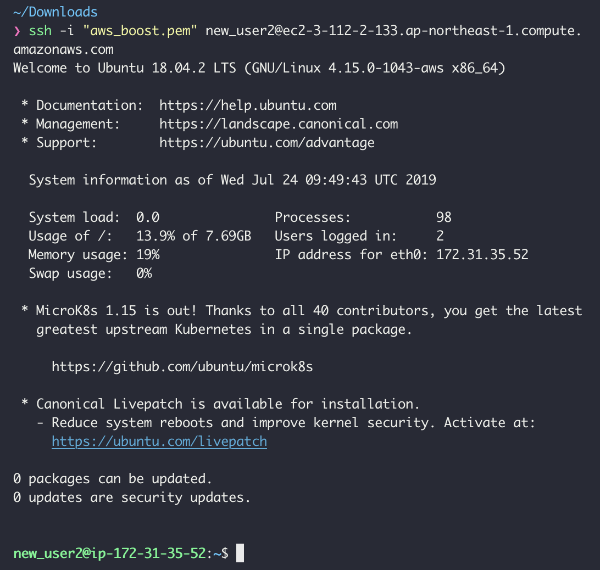
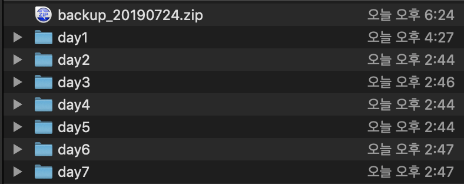

# day7-challenge_ss68 조민지
챌린지 day7 문제 해결 저장소


## 1)가상 환경 설치하기

- #### Amazon EC2 서비스를  사용했다.

  - instance 이름은 boostcamp이다.

  - AMI는 ubuntu 18.04 LTS 으로 설정했다.

    

- #### Amazon EC2 는 기본적으로 SSH 가 설치되어 있다.

  - 하지만, local 에서 접속하기 위해서는 security-group 설정할때  in-bound규칙으로 ssh(포트 22번)을 추가해줘야 한다.
  - 

- #### 새로운 사용자인 new_user2 을 추가해줬다.

  - Amazon EC2 인스턴스에 사용자를 추가하기 위해서 ssh/authorized_keys 공개키 파일을 추가해줬다.

  - $ ssh -i "aws_boost.pem" new_user2@ec2-3-112-2-133.ap-northeast-1.compute.amazonaws.com

  - 아래 접속이된것을 확인할 수 있다.

    

  - [참고 도큐먼트](<https://aws.amazon.com/ko/premiumsupport/knowledge-center/new-user-accounts-linux-instance/>)


## 2)쉘 스크립트 요구사항

- 문제 상황 만들기

  - problem 디렉토리 안에 16개의 디렉토리를 만들었다.

  - ```shell
    mkdir day{1..16}
    ```

  - day1, day3, day5 홀수 번호에 .js 파일을 몇 개 추가해줬다.

- js 확장자를 가진 파일 찾기

  - find 명령어를 사용했다. 

  - ```shell
    find day$num -type f | grep "\.js4"
    ```

- zip 파일로 만들기

  - zip 명령어를 사용했다.

  - ```shell
    zip -r local_backup.zip ./$file
    ```

  - 백업 파일명을 오늘 날짜로 만들기 위해 date 명령어를 사용했다. ( backup_20190724.zip )

    ```shell
    today=$(date '+%Y%m%d')
    zipName="backup_$today"
    ```

- 최종적으로 만들어진 파일

  

- zip 파일을 scp 명령어를 이용해 가상 머신으로 파일을 전송한다.

  - ```shell
    scp -i [파일경로]/aws_boost.pem -r [파일경로]/backup_20190724.zip new_user2@ec2-3-112-2-133.ap-northeast-1.compute.amazonaws.com:/home/new_user2/backup
    ```

- 가상 머신에 접속해 /backup 폴더에서 backup_20190724.zip 파일을 확인할 수 있다.

  


## 3) 타입스크립트 컴파일 요구사항

- 가상 환경에 day7 디렉토리를 만들고 권한을 764로 변경해준다.

- 로컬 환경에서 npm 을 이용해 typescript를 설치한다.

  - ```shell
    npm install -g typescript
    ```

- tsc 명령어를 이용해 .ts 파일을 컴파일한다. 나중에 shell 파일에 해당 명령어를 추가해준다.

  - ```shell
    tsc ./baseball.ts
    ```

- send_tsFile.sh 파일을 만들어 scp 명령어를 추가해준다. 

- 가상 머신에 접속해 /day7 폴더에서 baseball.js, baseball.html 파일을 확인할 수 있다.

  

- aws에서 인바운드 조건으로 8000번 포트를 추가해준다.

  

- local-web-server 을 설치하고 ws 명령어를 사용해 서버를 실행한다.

  - ```shell
    ws --spa baseball.html
    ```

- 결과 화면

  